In this tutorial we will add a share extension to Makestagram. If you are not sure what a share extension is... Here is what it looks like:
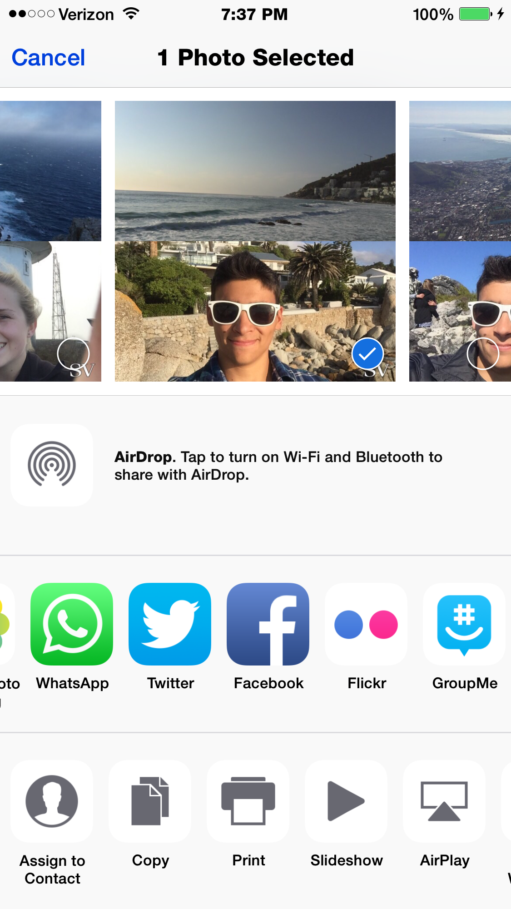

If I press the Facebook icon in photos app I can **share** the photo Facebook using their _share extension_. We will create one for Makestagram!

#Pre-requisites

It is preferable that you already completed the Makestagram tutorial, though this is not a must. Please download my [updated source code for Makestgram](http://github.com/tylerweitzman/Makestagram-Swift-Solution), with Parse updated to the latest framework. You may have to run `pod install` to get it working. [(See our Cocoapods tutorial)](https://www.makeschool.com/sa/tutorial/learn-how-to-build-makestagram-part-2/installing-libraries-using-cocoapods). Also, you will need to make sure to have an **iPhone Developer Account** and set up an App ID for the project with _App Group Privileges_. App Groups is a service provided by Apple that allows two parts of your application to communicate with each other. That is, your main app, Makestagram, is going to communicate with your extension. We call the main app our **containing application** and the extension our **contained application**. 

You can see a tutorial for adding an App ID under part 2 of [How to ship your app](https://www.makeschool.com/sa/tutorial/how-to-ship-your-app). Enabling _App Group Privileges_ is just a matter of checking a box under App Services (see photo below).
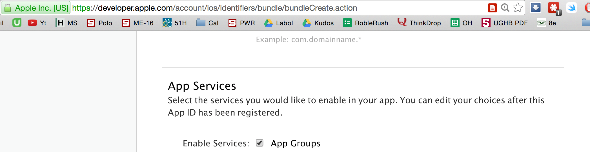

I created my own App ID called `com.tylerweitzman.Makestagram` -- yours will probably look similar but with your name instead of mine-- tylerweitzman.

Now make sure to go and change your bundle identifier inside of the Info.plist file. Simply edit the `Bundle identifier` key (photo below).
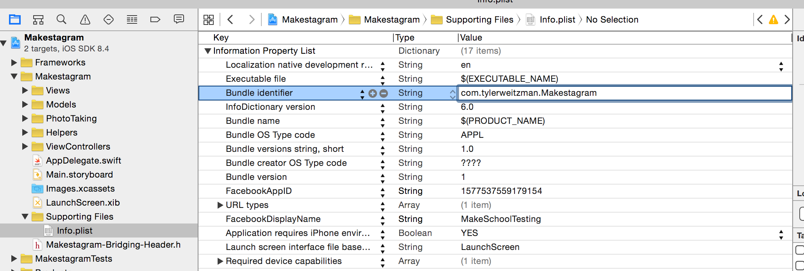

#Time to create the extension
We can create a blank share extension by going to File -> New Target -> Share Extension
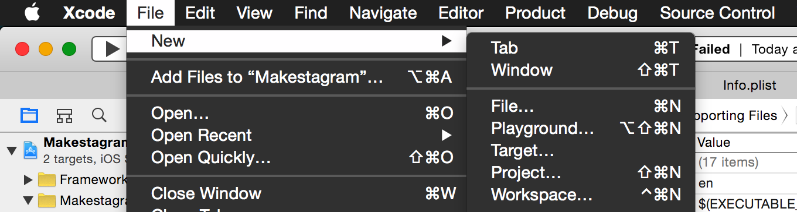
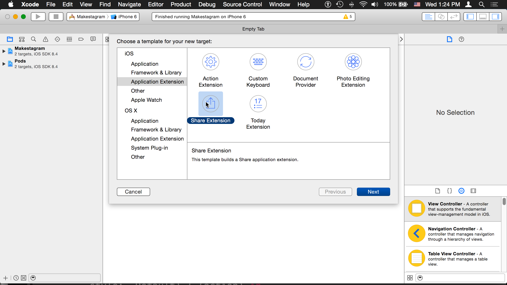
Give it any name you'd like with no spaces. I'm calling mine `SharePost`. **No spaces please**.

By the way, the option to create an action extension is quite similar. Both of these applications come with a template to get you started. I am a little disappointed in Apple because neither template is good enough and each one has components that the other needs. You will soon be provided in this tutorial with some boilerplate code that comes from the action extension template.

Before running the extension, let's make sure that we have the right app identifier set for the extension. Go to the Info.plist file that is inside the _extension_ folder and make sure that it is set to the app id you created online followed by the name of the extension. Mine is `com.tylerweitzman.Makestagram.SharePost`
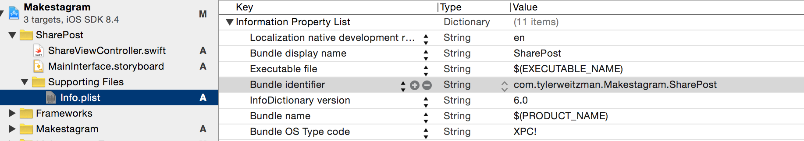
And if yours was not already set properly, you probably forgot to change the app identifier for the main application (so make sure you fix that now).

Let's try running our extension. Notice that you can choose which application you want to run on the left of the iPhone simulator.

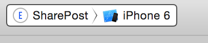
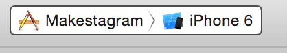

These two options are also known as **schemes**. We have the `SharePost` scheme and the `Makestagram` scheme. Notice that because the SharePost app is an extension you are asked where you would like to run it on the phone. Go ahead and try the photos app. You can then try sharing a post with the extension (you'll have to add it in under more).

Note: I ran into a few issues before I got it running. Xcode was giving me strange errors and I needed to restart Xcode, run another pod install, reset my simulator, **and** clear my derived data -- `sudo rm -rf ~/Library/Developer/Xcode/DerivedData/` in terminal.

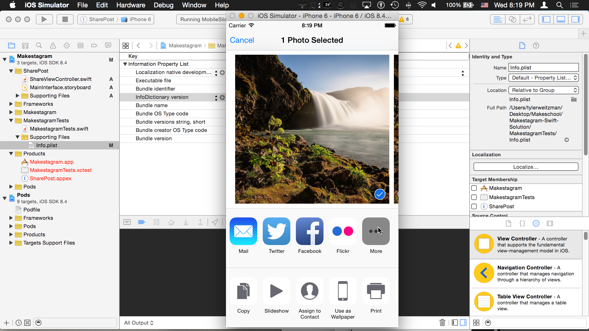
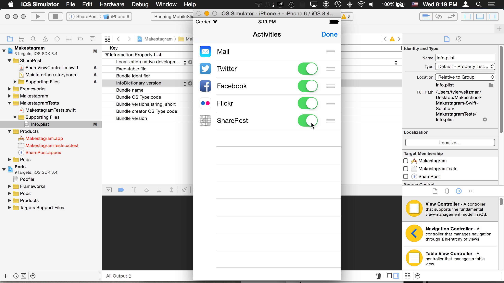

By the way, you will have to redo this process with the more button every single time while debugging, in fact you will need to turn off the extension and then turn it back on every single time; however it won't act like this once you submit it to Apple.

#Connecting the extension to Parse
At the end of the day, we want to be able to post to Parse from this extension. Connecting our extension to Parse is actually going to be the main challenge in creating this extension. Since extensions are like thier own little applications, they do not have access to the Parse framework that is already installed and they do not have access to the user that you logged into with Makestagram.

So our first step will be adding a Parse framework into our extension app. Visit your `Podfile` and add the following code.
>        target 'SharePost' do
            use_frameworks!
            pod 'Parse', '~> 1.7.5'
        end
        
What this does is it tells pod that we want version 1.7.5 of Parse in our `SharePost` target (or scheme). Why version 1.7.5? Because Parse recently released an update, 1.8.1 where there's a bug that doesn't allow extensions to work. So we have to stay on 1.7.5 until they fix it in the newer version. And yes, I had to learn of this bug the hard way. I'm not sure that they know..

Now run `pod install` in terminal.

Oh, looks like there's a problem. Cocoapods cannot install two different versions of Parse in the main project. So we'll have to edit the dependencies for our main application:
>        target 'Makestagram' do
          use_frameworks!
          pod 'DateTools'
          pod 'ParseUI', '~> 1.0'  
          pod 'ParseFacebookUtilsV4', '~> 1.5'
          pod 'FBSDKCoreKit'
          pod 'Parse' , '~> 1.7.5'
          pod 'Bond'
        end

And then run a `pod update` (**not install**)

Everything should now be working, so go ahead and add
>import Parse  
>import MobileCoreServices

To the top of the `ShareViewController.swift` file under the SharePost folder.

`MobileCoreServices` is an example of something we'll need that the action extension template pre-imports but the share extension template does not. While we are taking care of boiler plate code, please add the global variable `var postedImage : UIImage?` to the class and the following boilerplate function as well:
>            override func viewDidAppear(animated: Bool) {
                for item: AnyObject in self.extensionContext!.inputItems {
                    let inputItem = item as! NSExtensionItem
                    for provider: AnyObject in inputItem.attachments! {
                        let itemProvider = provider as! NSItemProvider
                        if itemProvider.hasItemConformingToTypeIdentifier(kUTTypeImage as String) {
                            // This is an image. We'll load it,
>                            itemProvider.loadItemForTypeIdentifier(kUTTypeImage as String, options: nil, completionHandler: { (image, error) in
>                                if let image = image as? UIImage {
>                                    self.postedImage = image
                                } else if let url = image as? NSURL {
>                                    self.postedImage = UIImage(data: NSData(contentsOfURL: url)!)
                                }   
                            })        
                            break
                        }
                    }    
                }
            }
            
This code would be provided by default if we were building an action extension, and all it does is grab the posted image for our use.

But it is of no use to us while Parse is not connected -- yes the framework is imported but we have plenty more work to do!

Go ahead and initialize Parse inside of the `didSelectPost()` method. This method runs when the "Post" button is pressed.
> Parse.setApplicationId("U1fn3pXGMUA8SvOqKgrpTXTKcW7jAbl8eGKpIOQc", clientKey: "EDx3EhQRmXFuoxyzXoL6bV7utRy0xKAYyHZpo2Zm")

Also notice the line 
>self.extensionContext!.completeRequestReturningItems([], completionHandler: nil)

At the end of the method. What this line does is kill the extension.

So where to next? Uploading the image? Not yet -- Parse is **still** not fully connected to the extension. We may have a logged in user inside of the _containing application_, Makestagram, but the user is not logged into the extension application, the _contained application_. 

We solve this issue using **App Groups** and **Keychain Sharing**. Together, these two services will allow our main application to share the login info of the user to our extension application. We already enabled App Groups in the App ID on our developer account, but we also have to enable it inside of Xcode. And we also have to enable Keychain Sharing.

#Sharing the User's Login
Click on the main project in the top left under the file navigator, then choose the "Makestagram" target, and then choose the Capabilities tab.
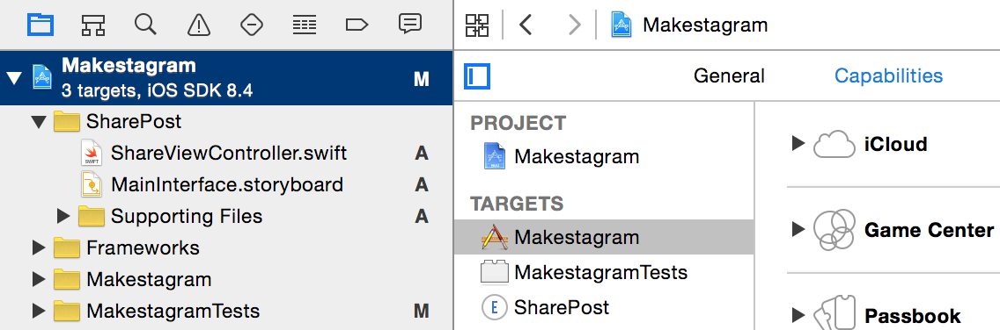
Now click the **ON** button for Keychain sharing.
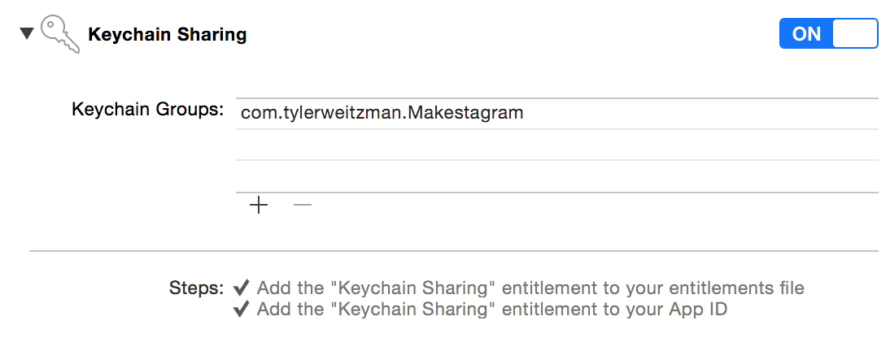
And click **ON** for App Groups
And add a **group identifier name**. I called mine `group.tylerweitzman.MakestagramGroup`
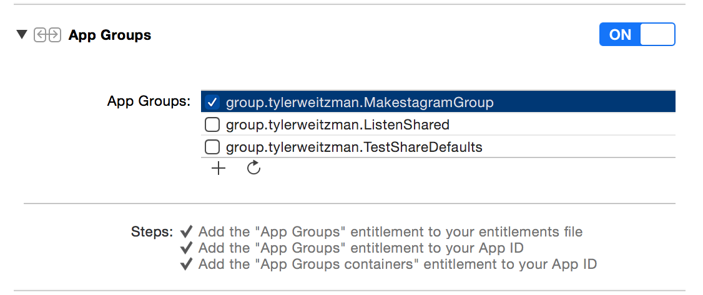

Now switch to the SharePost extension target and do the same thing there. Your app group name will be the same, and your Keychain will be appended with the extension target name. Both should pre-fill automatically.
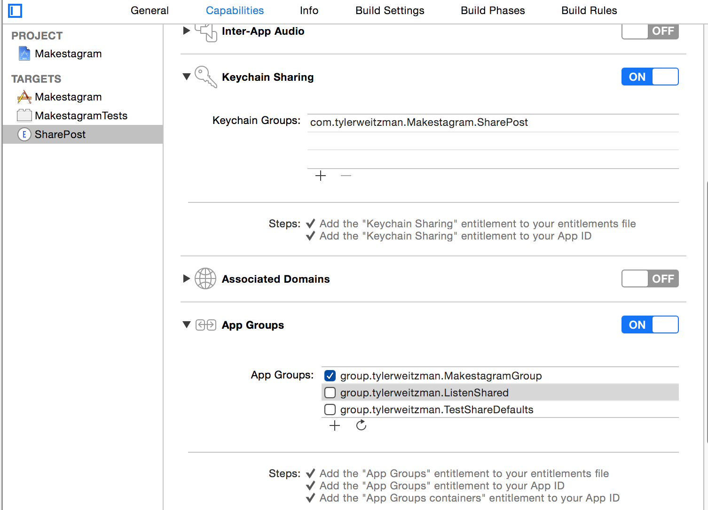

Now that we have activated these services in the developer page and in our project capabilities, we need to let Parse now that it can use this new group. Save the identifier (`group.tylerweitzman.MakestagramGroup` for example) as you'll need to use it soon.

Add the line 
>        Parse.enableDataSharingWithApplicationGroupIdentifier("group.tylerweitzman.MakestagramGroup", containingApplication: "com.tylerweitzman.Makestagram")

Right **above** where you initialize Parse in the `ShareViewController.swift` file. It has to be **above**. Like this:
>Parse.enableDataSharingWithApplicationGroupIdentifier("group.tylerweitzman.MakestagramGroup", containingApplication: "com.tylerweitzman.Makestagram")
>
>Parse.setApplicationId("U1fn3pXGMUA8SvOqKgrpTXTKcW7jAbl8eGKpIOQc", clientKey: "EDx3EhQRmXFuoxyzXoL6bV7utRy0xKAYyHZpo2Zm")

And replace the identifiers I used with the ones you've created -- one for your group and one for the main application, or containing application, identifier.

Underneath those two lines, add the line
>println(PFUser.currentUser()?.username)

This will print out the username of the logged in user -- so that we know if we successfully retrieve the user's login. Currently, we are not because there is one more step.

Go to the AppDelegate.swift file of your main application and add the following line there:
>        Parse.enableDataSharingWithApplicationGroupIdentifier("group.tylerweitzman.MakestagramGroup")

Again, replace the group identifier with your own, and make sure that the line is **above** where you initialize Parse. That is:

>Parse.enableDataSharingWithApplicationGroupIdentifier("group.tylerweitzman.MakestagramGroup")
>Parse.setApplicationId("U1fn3pXGMUA8SvOqKgrpTXTKcW7jAbl8eGKpIOQc", clientKey: "EDx3EhQRmXFuoxyzXoL6bV7utRy0xKAYyHZpo2Zm")

Now let's test this. You will have to run the main application first and log in again so that it can store the information in the shared keychain. I logged in with 
>username: test
>
>password: test

And then when I ran the extension app and tried posting a photo it printed the username in my console.
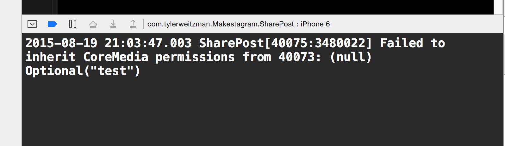

#Uploading the posted image
Now we have everything set up for the final step -- uploading our image!
We cannot use the `Post` class because it is not in our extension application, only in our main application. We could add it to our extension application but then we would run in to a whole slew of errors. Let's just upload the image with PFObjects.

>        override func didSelectPost() {
            Parse.enableDataSharingWithApplicationGroupIdentifier("group.tylerweitzman.MakestagramGroup", containingApplication: "com.tylerweitzman.Makestagram")
            Parse.setApplicationId("U1fn3pXGMUA8SvOqKgrpTXTKcW7jAbl8eGKpIOQc", clientKey: "EDx3EhQRmXFuoxyzXoL6bV7utRy0xKAYyHZpo2Zm")
>            
>          
>            println(PFUser.currentUser()?.username)
            if let image = postedImage, let user = PFUser.currentUser() {
                println("Image available")
                let postObject = PFObject(className: "Post")
                let imageData = UIImageJPEGRepresentation(image, 0.8)
                let imageFile = PFFile(data: imageData)
                postObject.setObject(imageFile, forKey: "imageFile")
                postObject.setObject(PFUser.currentUser()!, forKey: "user")
                postObject.save()
            }
>       self.extensionContext!.completeRequestReturningItems([], completionHandler: nil)
>
        }
>

This code should be familiar, we are creating a new Post object, setting its Image File to a JPEG file of the posted image, and setting its user value to the current logged in user.

If you run the extension it should be working! You can post to the Makestagram app directly from the Photos app.

But we have a glitch! If you post a second photo the extension crashes. This is happening because we can't initialize Parse with its Keychain sharing twice, so we need to surround those two lines with an If statement.
>            if PFUser.currentUser() == nil {
                    Parse.enableDataSharingWithApplicationGroupIdentifier("group.tylerweitzman.MakestagramGroup", containingApplication: "com.tylerweitzman.Makestagram")
                Parse.setApplicationId("U1fn3pXGMUA8SvOqKgrpTXTKcW7jAbl8eGKpIOQc", clientKey: "EDx3EhQRmXFuoxyzXoL6bV7utRy0xKAYyHZpo2Zm")
            }
            
Now you should be able to post as many times as you'd like.

#Additional Note
Note that if we were going to post this on the App Store, we would have to designate that this extension is particularly for **photo** sharing. We can do that in the Info.plist of the extension.

Instead of looking like this:
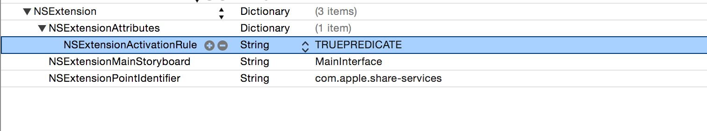
Make it look like this:
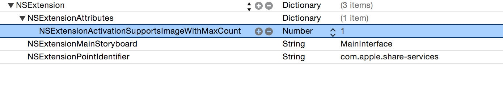

We would also want to add an icon for the extension in the general tab of the target.
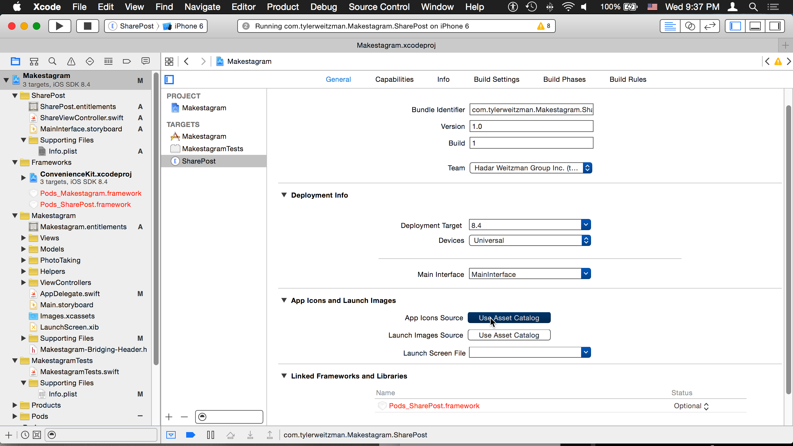

#Summary

Apple allowed custom extensions with the release of iOS 8.  Extensions allow apps to perform certain activities while outside of their running app.  Creating a Share Extension that uploads photos is a great addition to our Makestagram app.  It takes a few steps: add a new target to the existing project, connect Parse by sharing login details, and then uploading a photo.  Apple allows many different kinds of extensions, be sure to check them out.  Happy coding!